# Blackbird Dart Scoring System

Blackbird is a mobile-first web app for scoring darts with your league or
friends. It scores **X01 (501 / 301 / 701)**, **Cricket** (Standard, Cutthroat,
and No-score), and **Baseball**, keeps every player's stats in a shared
Postgres database, and layers on leaderboards, player profiles with trend
charts, an **Elo matchup predictor**, and an **AI insights** tab that answers
free-form questions about your league.

Everyone signs in with email/password, scores games on their phone, and the
stats sync instantly for the whole group. No game data is kept in
localStorage — Postgres is the single source of truth.

## Screenshots

*(Captured on a phone-sized viewport with demo data.)*

| Loading screen | Loading (dark) | Home |
|:---:|:---:|:---:|
| 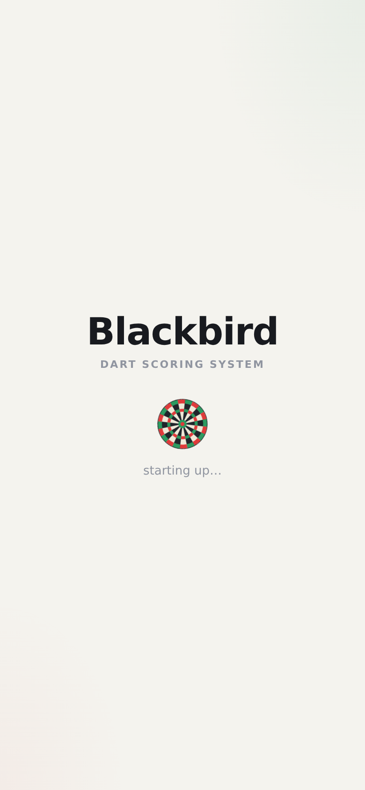 | 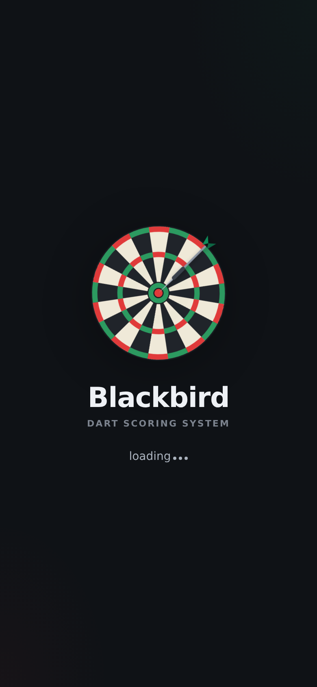 | 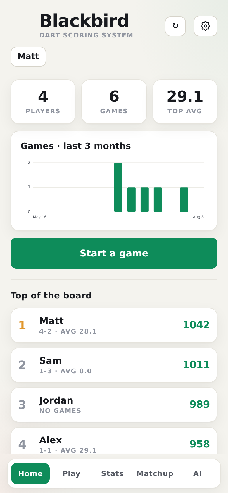 |

| Live cricket (MPR column) | Cricket leaderboard | Game setup |
|:---:|:---:|:---:|
| 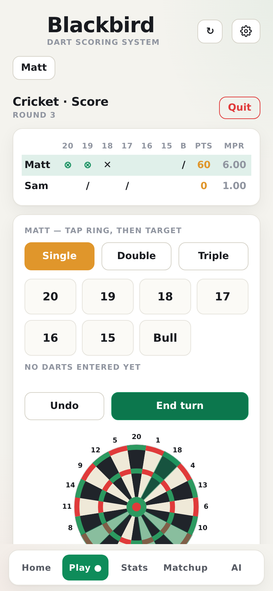 | 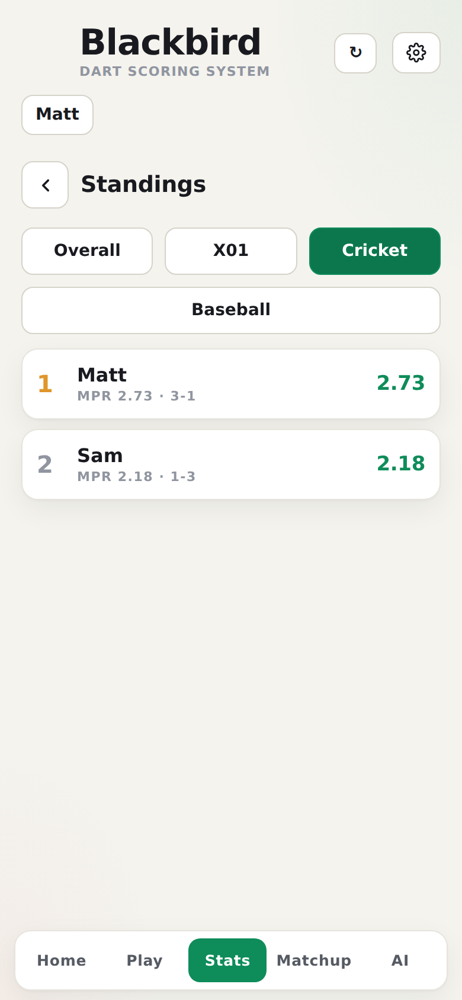 | 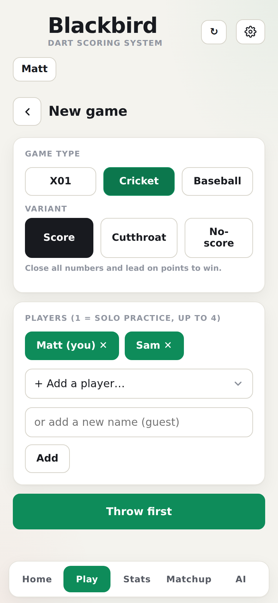 |

| MPR over time | Cricket profile card | Phone while casting |
|:---:|:---:|:---:|
| 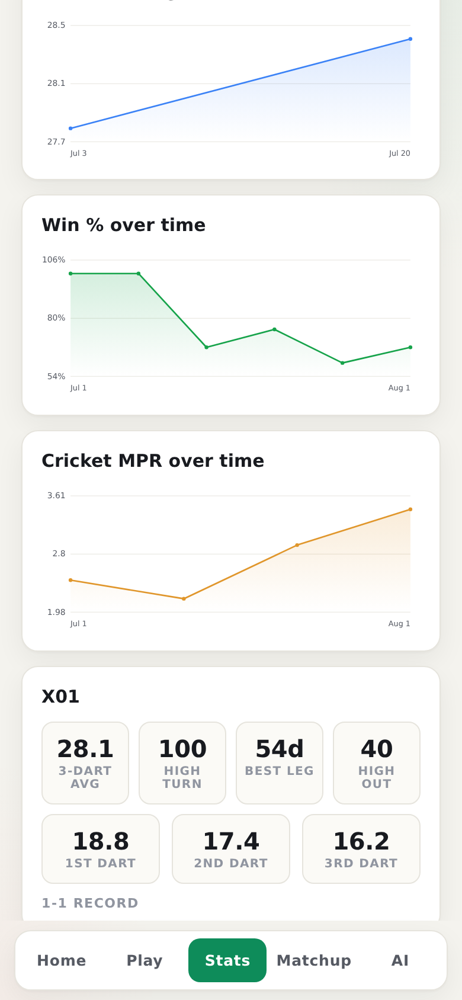 | 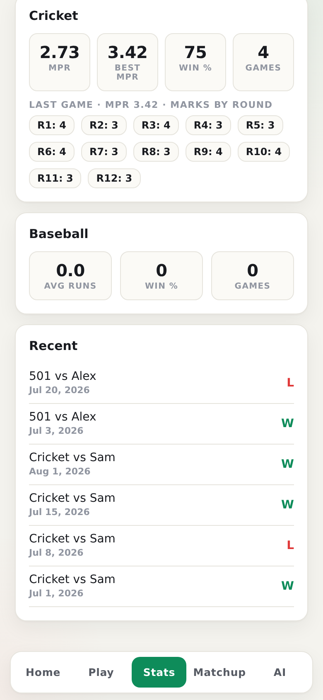 | 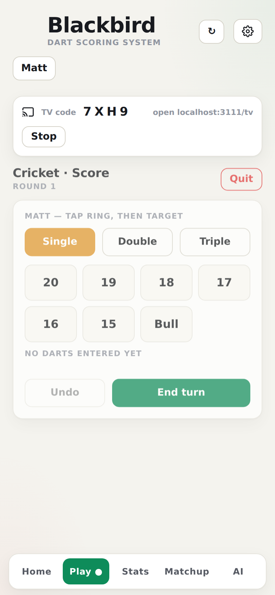 |

**TV scoreboard** (`/tv`, paired with the phone by a 4-character code):

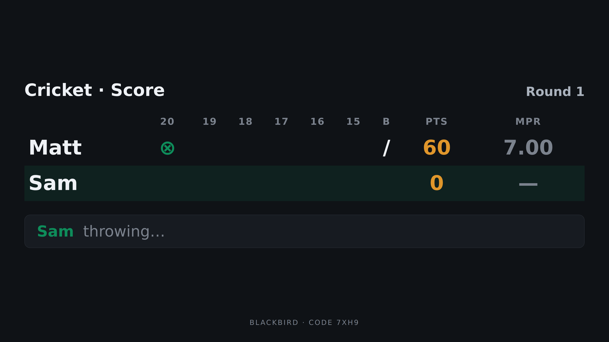

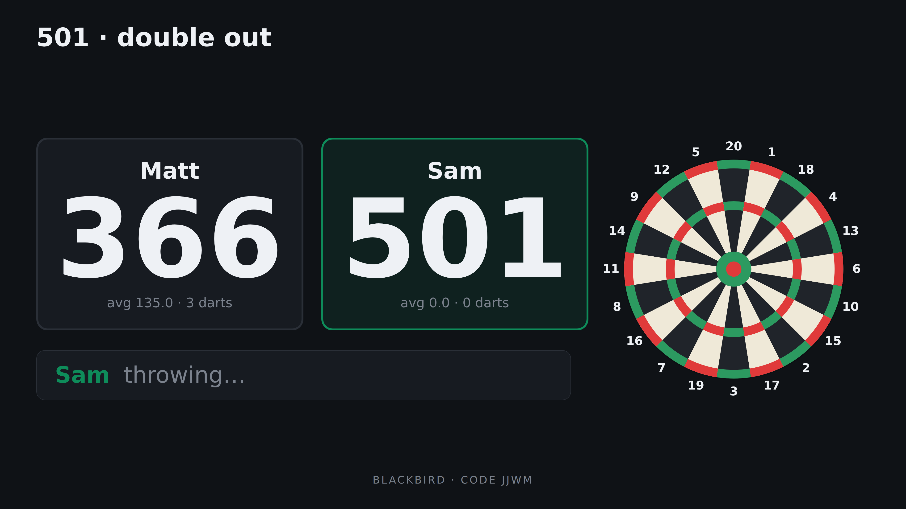

## What it is (at a glance)

- **TV scoreboard (cast mode)**: tap Cast to TV during any game, put the
  app's `/tv` page on a TV (AirPlay a Safari window, a smart TV browser, or
  a Chromecast tab-cast), enter the 4-character code, and the TV shows a
  huge live scoreboard while the phone switches to a simplified entry-only
  UI.
- **Responsive**: one codebase, three screen classes — phones (primary),
  tablets/desktop (wider layout, two-column charts), and TVs (`/tv`).
- **Launch splash**: every open starts with the Blackbird wordmark and a
  spinning mini dartboard as the loading wheel — a simple 8-section board
  drawn in one color per theme — held for 1–3 seconds. Seasonal touches:
  confetti and a party hat on the wordmark every September 11, falling
  snow all December (preview any day with `?occasion=birthday|snow`).
- **Games**: X01 with optional double-out, Cricket (3 variants), Baseball
  (9 innings + extra innings on ties).
- **Cricket MPR**: live **marks-per-round** for every player while the game is
  being played, per-round mark history saved with each game, career MPR and
  best-game MPR on profiles, and an MPR-over-time chart.
- **Home dashboard**: player/game/top-average tiles plus a bar chart of
  games played per week over the last 3 months.
- **Stats**: win %, 3-dart average (overall and per dart position), highest
  turn, best leg, highest checkout, MPR, average runs, and more.
- **Elo**: every multi-player game updates a shared Elo rating; the Matchup tab
  predicts win probability between any two players.
- **AI insights**: a serverless route sends league stats to the AI provider of
  your choice (Gemini, Groq, OpenAI, or Anthropic) and answers questions like
  "who has improved the most lately?".
- **Admin panel**: the configured admin account can manage login accounts,
  hide/delete players, reset scores, and try experimental full-app skins
  (theme lab — applies only to the admin's own account).

## System architecture

*(Deep dive: [ARCHITECTURE.md](ARCHITECTURE.md) documents the whole system
— boot sequence, data model, game-engine contract, TV cast protocol,
theming, security — end to end.)*

```
┌─────────────────────────────┐
│  Phones / browsers (PWA-ish) │  add-to-home-screen web app
└──────────────┬──────────────┘
               │ HTTPS
┌──────────────▼──────────────┐
│  Vercel — Next.js 14         │
│  (App Router, mostly client) │
│                              │
│  app/page.js  ── the whole   │
│    single-page app: auth     │
│    gate, views, live games   │
│                              │
│  app/api/insights/route.js   │  server-only: holds the AI key,
│    → Gemini/Groq/OpenAI/     │  verifies the caller's Supabase
│      Anthropic               │  session before spending quota
│                              │
│  app/api/admin/route.js      │  server-only: holds the Supabase
│    → Supabase service role   │  service_role key; only the
│                              │  ADMIN_EMAIL account may call it
└──────────────┬──────────────┘
               │ supabase-js (anon key + RLS)
┌──────────────▼──────────────┐
│  Supabase                    │
│  • Auth (email/password)     │
│  • Postgres: players,        │
│    game_results, matches     │
│    (legacy), RLS policies    │
└─────────────────────────────┘
```

Key design points:

- **The app is client-rendered.** `app/page.js` is one client component that
  swaps between views (Home, Setup, live game screens, Leaderboard, Profile,
  Matchup, Insights, Account, Admin). Live game state lives in React state and
  is checkpointed in-memory so you can navigate away and resume.
- **Scoring math runs in the browser.** When a game finishes, one row per
  player is written to `game_results` with that player's full game stats as
  JSONB, and each player's new Elo is written back to `players`.
- **Aggregation happens at read time.** `lib/stats.js` recomputes career
  stats, timelines, and head-to-head records from the raw `game_results` rows
  on every load — there are no denormalized aggregate tables to migrate.
- **Two server routes exist only to protect secrets**: the AI key
  (`/api/insights`) and the Supabase service-role key (`/api/admin`). Both
  verify the caller's Supabase session token first.

## How the app works

1. **Open the app** — a branded splash (the Blackbird wordmark with a
   spinning mini dartboard as the loading wheel) shows for 1–3 seconds on
   every launch while auth and data load behind it.
2. **Sign in** (Supabase email/password). Your display name is auto-added to
   the shared `players` list so everyone can pick you as an opponent.
3. **Setup** a game: pick the game type and options (start score + double-out
   for X01, variant for Cricket), and pick 1+ players.
4. **Cast to a TV (optional)** — tap **Cast to TV** on the live screen to
   get a 4-character code, open the app's `/tv` page on the TV (smart TV
   browser, AirPlayed Safari window, or Chromecast tab-cast) and enter the
   code. The TV renders the full scoreboard huge — live marks/points/MPR
   for cricket, giant remaining scores for X01, the box score for
   baseball, whose throw it is, and the darts of the current turn — and
   the phone collapses to a simplified entry-only UI. Multiple TVs can
   join the same code; the code stays active across games, and tapping
   Stop on the phone sends every TV back to its code-entry screen. A
   hide/show board toggle on the TV switches between the scoreboard-
   plus-dartboard layout and a score-only view with extra-large numbers
   (remembered per TV). Sync runs over Supabase Realtime broadcast (no login needed on
   the TV, nothing written to the database).
5. **Score the game** on the live screen. Cricket shows the classic marks
   grid, points, a **live MPR column**, and the current **round number**;
   there's full undo (per dart and per turn) and a dartboard heat view of the
   turn. Solo games are practice and are not saved.
6. **Finish** — the winner is detected automatically, Elo is updated pairwise
   (winner vs each loser), and a `game_results` row is inserted per player.
7. **Browse stats** — Leaderboard (sortable by Elo/X01/Cricket MPR), Profiles
   (trend charts + per-game history), Matchup (Elo win probability +
   head-to-head), Insights (AI questions), and your Player Card.

### Cricket MPR details

- **Standard (league-style) mark counting**: darts that advance closing a
  number always count; extra hits past a close count only while at least one
  opponent still has that number open (i.e., while they can score). **Dead
  darts** — thrown at a number everyone has closed, or surplus hits in the
  No-score variant — count **0 marks**. This matches how league/DartConnect
  MPR is computed.
- **Live MPR** = effective marks ÷ completed rounds, shown per player in the
  scoring table and updated at the end of every turn.
- **Per-round history**: each finished game stores `roundMarks` (an array of
  marks scored in each round) plus the final game `mpr` in the player's stats
  JSONB. Profiles show the round-by-round marks of your most recent cricket
  game.
- **Averages**: career MPR is total marks ÷ total rounds across all cricket
  games (a properly weighted average); profiles also show **best single-game
  MPR** and an **MPR-over-time** chart (one point per cricket game — this
  works retroactively for games recorded before per-round tracking existed).

## Data model (Supabase / Postgres)

Run `supabase/schema.sql` once in the Supabase SQL editor. Three tables:

- **`players`** — one row per dart player (a name, not a login):
  `username` (unique), `hidden` (kept out of standings), `elo` (current
  rating), `created_at`.
- **`game_results`** — one row **per player per finished game**: `game_id`
  (shared by all rows of one game), `username`, `game_type`
  (`x01` | `cricket` | `baseball`), `config`, `winner`, `result`
  (`win`/`loss`), `opponents`, `elo_after`, `completed_at`, and `stats` —
  a JSONB blob of that player's performance.
- **`matches`** — legacy one-row-per-game table kept for the admin "rebuild
  from old games" migration; new games do not write to it.

The `stats` JSONB per game type:

| Game | Fields |
|------|--------|
| x01 | `dartsThrown`, `pointsScored`, `highestTurn`, `checkout`, `finalScore`, `darts` (full dart log), `dartPos` (per-dart-position sums) |
| cricket | `marks`, `rounds`, `roundMarks[]` (marks each round), `mpr`, `pointsScored`, `darts` (full dart log) |
| baseball | `runs`, `darts` |

Because `stats` is JSONB, adding new per-game fields (like `roundMarks`)
requires **no SQL migration** — old rows simply lack the new keys and the
stats code tolerates that.

**Row Level Security**: any authenticated user in your Supabase project can
read and insert players/results (and update players for Elo writes). Nobody
can delete or rewrite history through the anon key; destructive actions go
through the admin route with the service-role key.

## Environment variables

| Variable | Where | Purpose |
|----------|-------|---------|
| `NEXT_PUBLIC_SUPABASE_URL` | client | Supabase project URL |
| `NEXT_PUBLIC_SUPABASE_ANON_KEY` | client | Supabase anon key (public by design; RLS protects data) |
| `AI_PROVIDER` | server | `gemini` (default), `groq`, `openai`, or `anthropic` |
| `GEMINI_API_KEY` / `GROQ_API_KEY` / `OPENAI_API_KEY` / `ANTHROPIC_API_KEY` | server | key for the chosen provider |
| `AI_MODEL` | server | optional model override |
| `SUPABASE_SERVICE_ROLE_KEY` | server | required only for the Admin panel |
| `ADMIN_EMAIL` | server | account allowed to use the Admin panel |

Server-side variables have no `NEXT_PUBLIC_` prefix, so they never reach the
browser.

# Deploy, start to finish

## 1. Code → GitHub
Push this repo to GitHub. Every later `git push` to `main` redeploys Vercel.

## 2. Supabase (database + login)
1. https://supabase.com → **New project** (set + save a DB password).
2. **SQL Editor → New query** → paste all of `supabase/schema.sql` → **Run**.
3. **Settings → API** → copy **Project URL** and the **anon public** key.
4. **Authentication → Providers → Email**: enabled. Turn **OFF** "Confirm
   email" so accounts work instantly on phones.
5. After everyone has signed up, turn **OFF** "Allow new users to sign up" to
   lock it to your group.

## 3. Pick an AI provider for the Insights tab

| Provider | Cost | Get a key | Default model |
|----------|------|-----------|---------------|
| **Gemini** | Free | https://aistudio.google.com/apikey | `gemini-2.5-flash` |
| **Groq** | Free | https://console.groq.com/keys | `llama-3.3-70b-versatile` |
| **OpenAI** | Paid | https://platform.openai.com/api-keys | `gpt-4o-mini` |
| **Anthropic** | Paid | https://console.anthropic.com | `claude-3-5-haiku-latest` |

Model names drift; if a default ever errors, set `AI_MODEL` to a current one.

## 4. Run locally (optional)
```bash
cp .env.example .env.local   # fill in Supabase values + AI_PROVIDER + the key
npm install
npm run dev                  # http://localhost:3000
```

## 5. Deploy to Vercel
1. https://vercel.com → **Add New → Project** → import your repo.
2. Add the environment variables from the table above (Settings →
   Environment Variables). `SUPABASE_SERVICE_ROLE_KEY` is only needed if you
   use the Admin panel.
3. **Deploy.** You get `https://….vercel.app`. Every `git push` redeploys.
4. Supabase → **Authentication → URL Configuration** → set **Site URL** to
   your Vercel URL (only needed if you left email confirmation on).

## 6. On phones
Open the Vercel URL, sign in. iPhone Safari → Share → **Add to Home Screen**;
Android Chrome → menu → **Add to home screen**. Data syncs via Supabase; the
app refreshes when it regains focus, and the ↻ button forces a refresh.

## Security notes

- The **Supabase anon key** is meant to be public; the RLS policies in
  `schema.sql` are what protect your data.
- The **service_role key** bypasses RLS. It is used only by
  `app/api/admin/route.js`, which independently verifies the caller is signed
  in **and** is `ADMIN_EMAIL` before doing anything. Keep it server-side only.
- The **AI key** stays on the server; `/api/insights` verifies a valid login
  before calling the model, so a stranger can't burn your quota.

## Known limitations (by design)

- X01 double-out is trusted, not verified (you enter darts per turn).
- One leg per match.
- Multiplayer Elo updates the winner pairwise; losers aren't ranked vs each
  other.
- Cricket games recorded before v1.2 have game totals (`marks`, `rounds`) but
  no per-round breakdown, and their MPR was counted under the old
  every-hit-counts rule.
- AI insights reflect only the stats in your database; with few games they're
  thin.

## Project structure
```
app/
  layout.js               root layout + metadata
  page.js                 the whole app: auth gate, views, live-game state
  globals.css             design system (themes, cards, cricket table, nav)
  api/insights/route.js   server-side AI call (secret key lives here)
  api/admin/route.js      admin actions via Supabase service role
  tv/page.js              TV scoreboard: code entry + live big-screen views
components/
  Auth.js                 sign in / sign up
  Home.js                 landing view + top players
  Setup.js                game type, options, player picker
  PlayX01.js              X01 scorer (per-dart entry, checkout tracking)
  PlayCricket.js          cricket scorer (marks grid, live MPR, per-round log)
  PlayBaseball.js         baseball scorer (9 innings + extras)
  Leaderboard.js          sortable standings (Elo / X01 / Cricket MPR)
  Profile.js              player page: trend charts + game history
  PlayerCard.js           shareable stat card
  Matchup.js              Elo win-probability predictor + head-to-head
  Insights.js             AI Q&A over league stats
  Account.js              profile settings, theme, font scale
  Admin.js                admin panel (accounts, players, resets)
  tv/TVScoreboard.js      big-screen cricket/X01/baseball scoreboards
  Charts.js               dependency-free SVG line + bar charts
  DartBoard.js            SVG dartboard with highlights/hits
  ui.js                   small shared UI pieces
lib/
  supabase.js             Supabase client
  cast.js                 TV-cast transport (Realtime broadcast + local)
  darts.js                shared dart/mark formatting helpers
  db.js                   data access (players, game_results)
  stats.js                Elo math, career stats, timelines, head-to-head
  constants.js            targets, cricket values, Elo constants, accents
  prefs.js                font-scale preference
supabase/
  schema.sql              run once in the Supabase SQL editor
  migration-*.sql         historical one-off migrations (already applied)
```

## License
MIT.
